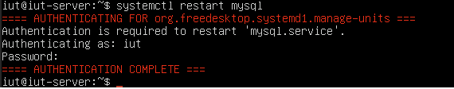

# Enzo ROLIN <code>roli0007</code> et Antoine LE GROS <code>le-g0067</code>

## Configurations Réalisées

### Gestion des services : systemd

Tout d'abord, nous avons lu le manuel de la commande systemclt avec la commande:  
<code>man systemctl</code>

Nous affichons la liste des services démarrés avec la commande <code>systemctl </code> :

Nous installons le paquet sshd avec la commande   
<code>sudo apt install openssh-server</code>

On verifie ensuite que le sshd est démarré en tapant la commande <code>ssh 10.31.11.146</code>

Nous tapons la commande <code>exit</code>

Nous stoppons le service sshd et tentons de nous reconnecter en tapant ces deux commandes <code>systemctl stop sshd  - ssh 10.31.11.146</code>

Nous constatons donc qu'apres avoir stoppé le service sshd nous ne pouvons pas nous reconnecter.

On redemarre ensuite le service sshd en tapant la commande <code>systemctl restart sshd</code>
 
Nous constatons que nous pouvons desormais nous reconnecter apres avoir redemarré le service sshd.

### 2. Serveur Web apache2

Nous installons le paquet apache2  
<code>sudo apt instal apache2</code>

Nous demarrons le service apache2 a l'aide de la comande <code>systemctl start apache2</code>

Cela fonctionne car nous avons accès a cette page web dont l'url est http://10.31.11.146 :  

Explorons le contenu du repertoire /etc/apache2 grace a la commande <code>ls /etc/apache2</code>

Nous lisons le fonctionnement du fichier apache2.conf :

Nous lisons le manuel de a2enmod : 

Nous activons les pages d'acceuil des utilisateurs et nous redemarrons le service apache2 pour recharger la configuration du serveur WEB a l'aide des commandes <code>a2enmod userdir</code> et <code>systemctl restart apache2</code>:

Nous créons le repertoire public_html dans le repertoire d'acceuil <code>sudo mkdir public_html</code>

On donne les droits d’accès à l’utilisateur du serveur Web www-data pour lui permettre l'accès à votre répertoire d’accueil ainsi qu'au répertoire public_html a l'aide des commandes :

Nous affectons les droits par défaut correspondant au répertoire public_html a l'aide de la commande  
<code>sudo setfacl -b public_html</code>

Nous verifions le bon fonctionnement 

Nous allons desactiver le systeme de listage dans le fichier userdir.conf en supprimant l'option Indexes en utilisant la commande <code>sudo nano userdir.conf</code>  

En effet nous n'avons plus accès au listage : 

Nous créons un fichier bienvenue.html dans ce répertoire, contenant la phrase "Bienvenue sur votre site perso" avec la commande <code>sudo nano bienvenue.html</code>

Nous verifions le bon fonctionnement de votre serveur en accédant à la page http://10.31.11.146/~iut/bienvenue.html 
et cela fonctionne car on peut voir le bienvenue.html:

### Configuration d'un serveur Web virtuel

Tout d'abord, nous tapons la commande   
<code>nslookup 10.31.11.146</code>

Nous creons ensuite un repertoire mon_serveur dans le repertoire d'acceuil
grace a la commande <code>sudo mkdir mon_serveur</code>

Nous donnons les droits d'accés a ce repertoire pour l'utilisateur www-data

Nous creons ensuite un lien symbolique avec la commande :  

Nous creons ensuite index.html dans le repertoire mon_serveur avec la commande :  
<code>sudo nano mon_serveur/index.html</code>

Nous nous deplacons dans le répertoire /etc/apache2/sites-available avec la commande :  
<code>cd /etc/apache2/sites-available</code>

Nous copions le fichier 000-default.conf en 2A4V2-31UVM146.conf avec la commande :  
<code>sudo cp 000-default.conf 2A4V2-31UVM146.conf</code>

Nous editons le fichier 2A4V2-31UVM146.conf de facon demandé : 

Nous activons le site et redemarons la configuration apache avec ces deux commandes  
<code>sudo a2ensite 2A4V2-31UVM146 -  
systemctl reload apache2</code>

Nous verifions l'accès à l'URL http://2A4V2-31UVM146.ad-urca.univ-reims.fr :

### 3. Serveur Web sécurisé https

Nous verifions  la présence des paquets nécessaires : libssl, openssl et ssl-cert
avec la commande <code>dpkg -l | grep ssl</code>

Nous creons le certificat en tapant les commandes <code>mkdir /etc/apache2/ssl   et  
/usr/sbin/make-ssl-cert /usr/share/ssl-cert/ssleay.cnf /etc/apache2/ssl/apache.pem</code>

Nous créons le fichier de configuration du VirtualHost de votre serveur ssl en faisant une copie du fichier default-ssl.conf du répertoire /etc/apache2/sites-available en tapant la commande :
<code>cp default-ssl.conf mon-serveur-ssl.conf</code>

Nous editons ce fichier pour ajouter ou modifier les lignes demandées grace a la commande <code>sudo nano mon-serveur-ssl.conf</code>:

Nous tapons ces trois commandes a la suite afion d'activer le module ssl, d'activer le site et redemarrer le service apache  
<code>sudo a2enmod ssl</code>  
<code>sudo a2ensite mon-serveur-ssl.conf</code>  
<code>systemctl restart apache2</code>

Nous testons voir si le site fonctionne avec l'URL : https://2a4f1-31upca226.ad-urca.univ-reims.fr

### 4. Langage de programmation PHP

Nous installons les paquets php et libapache2-mod-php avec les commandes : 
<code>sudo apt install php - sudo apt install libapache2-mod-php</code>

Nous editons le fichier /etc/apache2/mods-enabled/php7.4.conf et commentons les 5 dernières lignes avec la commande  
<code>sudo nano /etc/apache2/mods-enabled/php7.4.conf</code>

Nous redemarrons le service apache 2 avec la commande <code>systemctl restart apache2</code>

Nous créons un fichier index.php dans notre répertoire public_html contenant la ligne suivante : <?php phpinfo();
<code>cd public_html – sudo nano index.php</code>

Nous verifions le bon fonctionnement de la page dans le navigateur

### 5. Serveur de base de données MySQL

On installe le paquet mysql-server avec la commande <code>sudo apt install mysql-server</code>

Nous configurons la sécurité de  la manière suivante :

(voir Problèmes rencontrés)

Nous nous connectons en tant que root :
<code>sudo mysql</code>

Nous creons un utilisateur avec un mot de passe qui est 'Azerty01' avec la commande :  
<code>CREATE USER 'admin'@'localhost' IDENTIFIED BY ‘Azerty01’;</code>

Nous donnons les privilèges a cet utilisateur avec la commande <code>GRANT ALL PRIVILEGES ON *.* TO 'admin'@'localhost' WITH GRANT OPTION;</code>

On quitte mysql avec la commande : 
<code>exit</code>

Nous redemarrons le service mysql avec la commande <code>systemctl restart mysql</code>

Nous testons le serveur avec la commande   
<code>mysqlshow -u admin -p</code>  

### 6. Outil d'administration de bases de données phpMyAdmin

On installe le paquet phpmyadmin avec la commande : <code>sudo apt install phpmyadmin</code>  

Puis, nous répondons aux questions.

Nous sélectionnons apache2 et nous selectionnons **"Oui"** pour l'utilisation de dbconfig-common.

On selectionne comme mot de passe **Azerty01** pour l'utilisateur admin

On active le module de gestion des chaînes de caractères multi-octets de php avec la commande : <code>sudo phpenmod mbstring</code>

On redémarre ensuite le service apache2.  

Nous testons phpmyadmin en nous connectant à http://10.31.11.226/phpmyadmin.  
  

Nous créons un utilisateur mysqltest en cochant l'option "Créer une base portant son nom" et donnez à cet utilisateur tous les privilèges sur cette base.  
  

Nous testons la connexion à phpMyMdmin avec cet utilisateur.  

### 7. Installation du CMS WordPress

On utilise la commande wget pour télécharger l’archive WordPress dans le répertoire personnel de l'utilisateur iut :
<code>wget https://fr.wordpress.org/latest-fr_FR.zip</code>  

On installe le CMS dans le répertoire /home/iut/mon_serveur tout en suivant la procédure détaillée sur https://fr.wordpress.org/support/article/how-to-install-wordpress/.  
  
  

On termine l'installation.  
Tout d'abord, on créer une base de données et un utilisateur.  
  

Ensuite, on configure le fichier wp-config.php. 
Pour cela, nous allons sur le site https://2a4f1-31upca226.ad-urca.univ-reims.fr/wordpress/wp-admin/setup-config.php  
  
Où l'on remplie les informations avec celles sur phpmyadmin.
Après, on obtient un code à reproduire
  
On renomme le fichier wp-config-sample.php en wp-config.php et on l'édite la configuration
  

A la fin, nous validons l'installation et on remplit les champs du formulaire.
  
Et juste après, nous arrivons sur le site https://2a4f1-31upca226.ad-urca.univ-reims.fr/wordpress/wp-admin.

Nous vérifions le bon fonctionnement en accédant à l'URL http://2a4f1-31upca226.ad-urca.univ-reims.fr/.

## Problèmes rencontrés

>Nous avons rencontré peu de problème au cours de cette SAÉ mais nous allons vous citer les principaux :
### Création d'une nouvelle machine virtuelle : 

- Au cours de l'étape 2 (Serveur Web apache2) dans la partie "Configuration d'un serveur Web virtuel", nous avons crée une nouvelle machine virtuelle car le DNS ne voulait plus fonctionner apres un redemarrage. Suite a la création de la nouvelle et avoir retapé toutes les commandes précédentes, la machine virtuelle fonctionnait parfaitement et le DNS aussi.

### Erreur au niveau du <code>sudo mysql_secure_installation</code> :
- En effet, après avoir tapé la commande ci dessus, le terminal provoqué une erreur au niveau du mot de passe, il refusait peu importe le mot de passe entré et il etait pour nous impossible de sortir de l'interface ou il fallait tapé le mot de passe. Après plusieurs recherche nous avons trouvé la commande :  
<code>ALTER USER ‘root’@’localhost’ IDENTIFIED WITH mysql_native_password BY ‘Azerty01’; </code>
Suite a cette commande, nous avons retapé la commande :  
<code>sudo mysql_secure_installation</code>  
Et cela a fonctionné car il n'y avait plus l'erreur.
